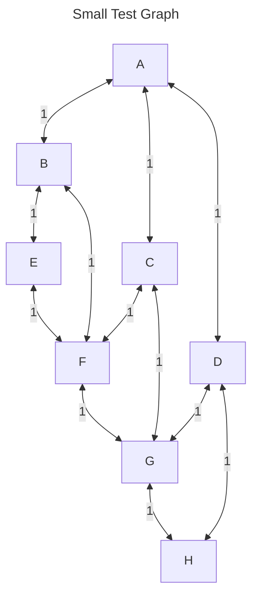
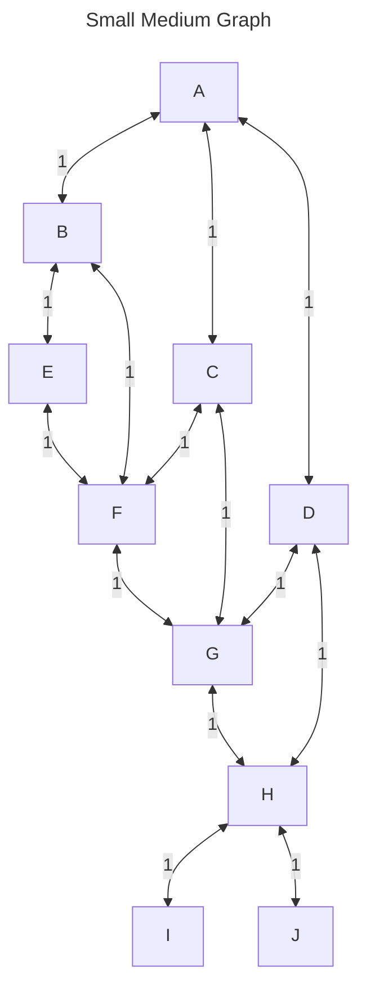
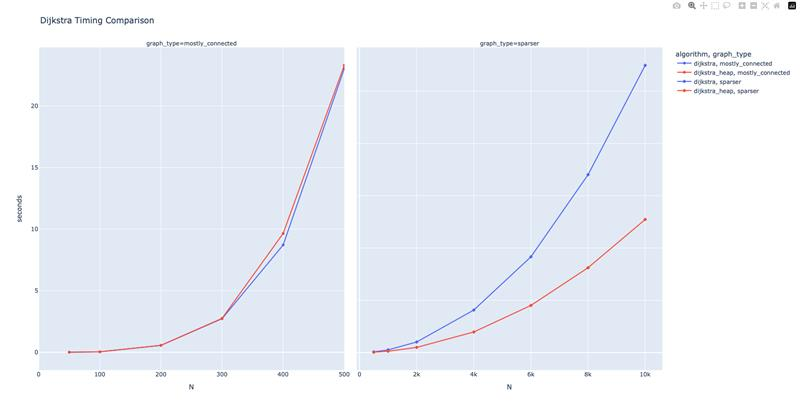

# Team Activity: Exploring Dijkstra's Algorithm
Attendance:  
MinHsun Hsieh  
Bailey Jung  
Tasnia Bhuiyan   
Oksana Pooley   
Anam Shamsi 

In this team activity, you will explore Dijkstra's algorithm run time efficiency by comparing it against a version that uses a priority queue/heap, and a version that uses a list. You will also explore the effect of the graph density on the run time of Dijkstra's algorithm.


The goals for this  activity are as follows:
* Learn about Dijkstra's algorithm
* Monitor the run time as the number of edges increase in the graph
  
## :star: Working in Teams :star:
When working in teams, remember do not let one person do all the work. Make sure to work together, and ask questions. It is also better if different people program, and you all take turns programming for various team assignments. 

## Provided Files
For this team activity, we have provided three python files. 
* [graph.py](graph.py) - Contains the Graph class, which is used to represent a graph. 
* [shortest_path.py](shortest_path.py) - Contains the Dijkstra's shortest_path functions, which is used to find the shortest path between two nodes in a graph. 
* [tests.py](tests.py) - Contains tests including the ability to time the run time of the shortest_path functions.


👉🏽 **Task** 👈🏽

1. Read through the code in the provided files. Explain the various lines to each other.
   * What is a major difference between the shortest_path functions? 
  > shortest_path_dijkstra_heap is use Priority Queue, heapq will automatically find the minimum value. 
   shortest_path_dijkstra is use normal List, when we need to find the minimum value, we need find out all of node. 
   
   * Why would this matter? (We will continue to explore this throughout the team activity)
   > The second function is not efficient for large graphs.
   
1. In graph.py, we are creating  a small and medium graph. Take a moment and draw on the paper the visualization of the graph that those represent. 






## Visualizing Dijkstra's Algorithm

Take the graph you built for `create_small_test_graph()`, and work through manually with your group how Dijkstra's algorithm would work. As a reminder, here is Dijkstra's algorithm in more plain terms:

```python
def dijkstra(graph, start, end):
    # Initialize the distance to all nodes to infinity
    # Initialize the distance to the start node to 0
    # Initialize the previous node to None for all nodes
    # Initialize the previous node to the start node for the start node
    # Initialize the unvisited set to contain all nodes
    # While the unvisited set is not empty:
        # Find the unvisited node with the smallest distance
        # Remove the node from the unvisited set
        # For each neighbor of the node:
            # Calculate the distance to the neighbor
            # If the distance to the neighbor is less than the current distance:
                # Update the distance to the neighbor
                # Update the previous node to the current node
    # Return the distance to the end node
```
👉🏽 **Task** 👈🏽
Visualize the algorithm on the graph you drew.
| Iteration | Processed | dist[A] | dist[B] | dist[C] | dist[D] | dist[E] | dist[F] | dist [G] | dist[H] |
| :-----: | :-----: | :-----: | :-----: | :-----: | :-----: | :-----: | :-----: | :-----: | :-----: |
| Initial | {} | 0 | ∞ | ∞ | ∞ | ∞ | ∞ | ∞ | ∞ |
| 1 | {A} | 0 | 1 | 1 | 1 | ∞ | ∞ | ∞ | ∞ |
| 2 | {A,B} | 0 | 1 | 1 | 1 | 2 | 2 | ∞ | ∞ |
| 3 | {A,B,C} | 0 | 1 | 1 | 1 | 2 | 2 | 2 | ∞ |
| 4 | {A,B,C,D} | 0 | 1 | 1 | 1 | 2 | 2 | 2 | 2 |
| 5 | {A,B,C,D,E} | 0 | 1 | 1 | 1 | 2 | 2 | 2 | 2 |
| 6 | {A,B,C,D,E,F} | 0 | 1 | 1 | 1 | 2 | 2 | 2 | 2 |
| 7 | {A,B,C,D,E,F,G} | 0 | 1 | 1 | 1 | 2 | 2 | 2 | 2 | 2 |
| 8 | {A,B,C,D,E,F,G,H} | 0 | 1 | 1 | 1 | 2 | 2 | 2 | 2 | 2 |


You can also use the Visualization tool provided by the University of San Francisco to visualize Dijkstra's algorithm (link in the resources section). 

## Running the Code
Once you have a good understanding of the algorithm and the code, it is time to run tests. You can do this by loading
tests.py into the interactive python environment. 

You can do this via the command line with:

```bash
$ python3 -i tests.py
```

This will load the tests.py file into the interactive python environment, which in turn imports the graph.py and shortest_path.py files. From here, you can run various commands such as

```python
>>> test_small()
nodes: ['A', 'B', 'C', 'D', 'E', 'F', 'G', 'H'] edges: [('A', 'B', 1), ('A', 'C', 1), ('A', 'D', 1), ('B', 'E', 1), ('B', 'F', 1), ('C', 'F', 1), ('C', 'G', 1), ('D', 'G', 1), ('D', 'H', 1), ('E', 'F', 1), ('F', 'G', 1), ('G', 'H', 1)]
2
>>> test_medium()
nodes: ['A', 'B', 'C', 'D', 'E', 'F', 'G', 'H', 'I', 'J'] edges: [('A', 'B', 1), ('A', 'C', 1), ('A', 'D', 1), ('B', 'E', 1), ('B', 'F', 1), ('C', 'F', 1), ('C', 'G', 1), ('D', 'G', 1), ('D', 'H', 1), ('E', 'F', 1), ('F', 'G', 1), ('G', 'H', 1), ('H', 'I', 1), ('H', 'J', 1)]
3
```

More importantly, you will see two tests that use timings. 

👉🏽 **Task** 👈🏽

Build a table based on the timings for both run_timed_test, both with a mostly connected graph and a sparser graph. The N will vary greatly between the two. For mostly connected, a 500 node graph took about ~2 minutes. For a sparser 10,000 node graph took 18 seconds to run the entire function. This is the difference of $2n-1$ compared to up to $n^2$ edges. 

| Graph Type | N |  Dijkstra's algorithm | Dijkstra's algorithm with heap |
| Sparse | 50 |  0.0023807910038158298 | 0.0004362920008134097 |
| Sparse | 100 |  0.0019316670077387244 | 0.0008652500109747052 |
| Sparse | 500 |  0.035806542000500485 | 0.010052084020571783 |
| Sparse | 1000 |  0.0806178750062827 | 0.022216750017832965 |
| Sparse | 2000 |  0.21184200001880527 | 0.0882272080052644 |
| Sparse | 3000 |  0.42301541700726375 | 0.19703383397427388 |
| Sparse | 4000 |  0.7554406249837484 | 0.3513763749797363 |
| Sparse | 5000 |  1.1935891660104971 | 0.5499990420066752 |
| Sparse | 6000 |  1.6568310419970658 | 0.8069550410145894 |
| Sparse | 7000 |  2.28506062499946 | 1.0927600840223022 |
| Sparse | 8000 |  3.0466509590041824 | 1.4442387910094112 |
| Sparse | 9000 |  3.9422053750022314 | 1.849653709010454 |
| Sparse | 10000 |  4.89116033402388 | 2.2729397079965565 |

| Connected | 50 |  0.009686749981483445 | 0.013444500014884397 |
| Connected | 100 |  0.06542129200533964 | 0.03400341601809487 |
| Connected | 500 |  20.69284679100383 | 20.920270415983396 |
| Connected | 1000 |  0.0806178750062827 | 0.022216750017832965 |




### Discussion  

* Take a moment to discuss the differences in speeds, what are some major points of difference between the different implementations of Dijkstra's algorithm? 

The heap uses a  Priority Queue to automatically maintain the minimum value. So the smallest node take O(log V).
And the List version manully scan all node to find out minimum, so it take O(V) for the time.
This makes the Heap version significantly faster on large graphs.
* Did the differences go away (mostly) in a certain situation? 
After we test, when number sides over to 7000, those gap is reduce.
  * If so, what triggered that (think in respect to edges)?
  It maybe when the side close to n^2, heap version requires frequent push and pop. Instead, it counteracts the advantage of Priority Queue.


## Research

👉🏽 **Task** 👈🏽

Research the time and space complexity of Dijkstra's algorithm. Between the two different implementations presented, what is the time and space complexity of each?

| Implementation | Time Complexity | Space Complexity |
|:--------------:|:---------------:|:----------------:|
| Dijkstra (List) |      O(V²)     |        O(V)      |
| Dijkstra (Heap) |  O((V + E) log V) |    O(V)       |


* In regards to time/space complexity, how did the total number of edges affect the run time of the algorithm?

###  List Version - O(V²)
The minDistance() function scans all V nodes every iteration, and this run V times total, so it is O(n ^ 2).
### Heap Version - O((V+E) log V)
The priority queue always selects the node with the smallest distance, so each node is processed only once. Each push/pop operation takes O(log V), and since each edge triggers at most one push, the total time is O((V+E) log V). 

## Technical Interview Practice

Take time practicing some of the past modules challenge problems. While you may not have time for everyone to do this, have a couple people practice "live coding". Live coding is a skill in interviews were you are asked to describe code **while** you are writing it. It can be a challenging skill, and it takes practice. I recommend that you setup a rotation of people to practice this skill within your team, ideally a couple every week. The other teams members can offer support, and then do a code review after a solution is generated. Then, as a group work a technical interview problem to discuss possible solutions.


## 📚 Resources
* Dijkstra's Algorithm - [https://www.geeksforgeeks.org/dsa/dijkstras-shortest-path-algorithm-greedy-algo-7/](https://www.geeksforgeeks.org/dsa/dijkstras-shortest-path-algorithm-greedy-algo-7/)
* Dijkstra's Algorithm - [https://en.wikipedia.org/wiki/Dijkstra%27s_algorithm](https://en.wikipedia.org/wiki/Dijkstra%27s_algorithm) 
* Dijkstra's Algorithm - [https://www.geeksforgeeks.org/dijkstras-shortest-path-algorithm-greedy-algo-7/](https://www.geeksforgeeks.org/dijkstras-shortest-path-algorithm-greedy-algo-7/)
* Dijkstra's Algorithm Visualization - [https://www.cs.usfca.edu/~galles/visualization/Dijkstra.html](https://www.cs.usfca.edu/~galles/visualization/Dijkstra.html)