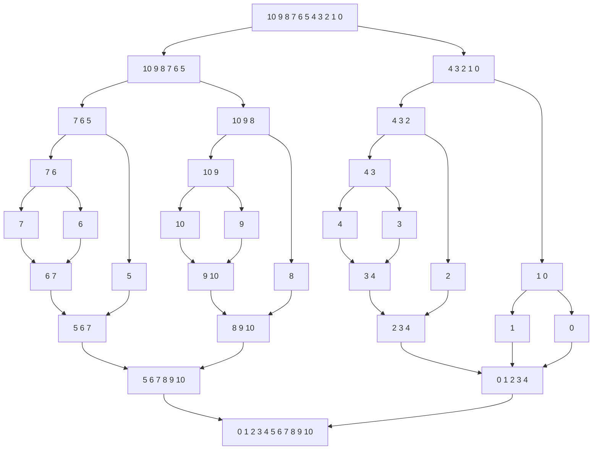

Attendance:
MinHsun Hsieh
Bailey Jung
Tasnia Bhuiyan
Oksana Pooley

# Lab- Sorting Part 2: Merge Sort

> [!IMPORTANT]
> This activity builds on your Homework and Lab - Sorting. While we have provided template files here, you will want to merge (pun intended) this code into your Homework 05.  Please make sure to give credit on who worked on this code with you. As a reminder, the stuff done in team activities are the team's work, but your other homework requirements are your *own* (don't plagiarize!)

👉🏽 **Task**: As a group you will implement the `merge` and the `mergeSort` function in [sorts.h](sorts.h). 

Merge sort is a [divide and conquer algorithm] that was invented by [John von Neumann] in 1945. Merge sort has a worst-case time complexity being $Ο(n\log n)$. Of our sorting algorithms that we have seen, this is the best overall time complexity.

> Yes, the same von Neumann who designed [modern computer architecture]. 

The goals for this team activity are as follows:
* To implement merge sort as a group
* To better understand divide and conquer type algorithms
  
  
## :star: Working in Teams :star:
When working in teams, remember do not let one person do all the work. Make sure to work together, and ask questions. It is also better if different people program, and you all take turns programming for various team assignments. 

## Merge sort works as follows:

1. Repeatedly divide the unsorted array into n subarrays (a subarray being 'a smaller part' of the original array) until each subarray contains one element (Note: an array of one element is already sorted).
2. Then, repeatedly merge subarrays to produce new sorted subarrays until there is only one subarray remaining. The result will be the sorted array.


Here is a diagram showing the two steps above in the picture (As they say a picture is worth a thousand words!):

![Merge Sort]


As we are learning about psuedo-code, here is the same thing in psuedo-code:
```text
mergeSort(arr[], temp[], l,  r):
  if r > l
     1. Find the middle point 'm' to divide the array into two halves:  
             m = (l+r)/2
     2. Call mergeSort for first half:   
             Call mergeSort(arr, temp, l, m)
     3. Call mergeSort for second half:
             Call mergeSort(arr, temp, m+1, r)
     4. Merge the two halves sorted in step 2 and 3:
             Call merge(arr, temp, l, m, r)
```

### Discussion

1. Given the pseudo code: is merge sort an [in-place algorithm]? Why or why not? 
Requires a temporary array. Reading and writing over the same range of array will overwrite, hence the need for an auxiliary array. 


Not, because the normal merge sort need an addition staging array to hold the merge result during the merge process.
## MergeSort
In sorts.h, find `merge_sort(int arr[], int temp[], int l, int r)`. This is your primary of two functions you will want to implement. 


You will find the temp array has already been created for you in the provided function

```c
void mergeSortIntegers(int *array, unsigned int size, int print)
{ // print is ignored for this one
    if (array == NULL)
    {
        exit(1);
    }
    if (size <= 1)
        return;

    int *temp = (int *)malloc(sizeof(int) * size);
    merge_sort(array, temp, 0, size - 1);
    free(temp);
}
```

As such, your mergeSort function may only be three lines excluding NULL and size checks! Divide one half, Divide the other half, then merge the return result!

Make sure to compile as you write, as it is easier to track syntax errors. 

## Merge

This function can be a bit complex, if you don't carefully think about it. You have two arrays. Your temp array is handling where you first store the "sorted values". At the **end of the merge**, you copy your temp array, back into your original array. 


```c
for (i = l; i <= r; i++)
{
   arr[i] = temp[i];
}
```

### Building the temp array
The locations actually give the split arrays. So you have an array from `l` to `m` and an array from `m+1` to `r`. 

That is why in the provided code
```c
int i = l; // the start of the first array
int j = m+1; // the start of the second array!
```

and since the temp array has to hold all values as they are merging, we only modify the same indices in the sorted array, making `int start = l`

That will mean we will be copying from

```c
temp[start++] = arr[i++]; // or j++ depending on which is higher or lower, or both if they are equal!
```

#### Don't forget
It is also easy to forget to copy the remainder of the array into temp that hasn't been evaluated! 

In the end, you end up with 3 while loops (not nested!). 


### Discuss and Build
Work together with your partners to build the merge function. While the code is provided online, it is important to understand each step, so take piece of paper out and draw samples.  Comment in the code with your understanding.


In the dataset {10, 9, 8, 7, 6, 5, 4, 3, 2, 1, 0}, the l = 0 and the r = 10. The mid point will be 5. The first split will be from 0-5{10, 9, 8, 7, 6, 5} and 6-10{4, 3, 2, 1, 0}. We will continue splitting until all the sub arrays have reach a size of 1. Then, in the reverse order we split the elements, we begin comparing the integers and merging them back in order. We do this until the entire array is merged back and is now sorted. 


> **Challenging**:  
> The merge sort is a challenging algorithm, that looks simple after it is completed. It is why we are doing it in a group, and you are free to use online resources if you get stuck. Just make sure you **understand** what is going on.
>


> [!NOTE]
> You are welcome to add a operations counter, and see how the operations look.
> However, we recommend you setting a print flag for the ops counter, 
> so it doesn't mess up your homework output. 

## Other Sorts?
Take time to search additional sorts online (there are a *ton* of them). Each person should find a sort, and describe to the group what situations it is best used for. Even better if you can find a visualization for that sort.  

**Anam: Selection Sort:** This sort repeatedly scans the list to find the smallest element and swaps it into the correct position at the front, growing a sorted section one item at a time. It's simple and uses very litle extra memory, but it's inefficient for large data sets because it always runs in quadratic time. 
https://www.geeksforgeeks.org/dsa/sorting-algorithms/


Bailey - 3-way merge sort: This merge sort works similarly to merge sort but in stead of breaking in half it breaks the array into thirds. The goal of this is to reduce the depth of the recursion. https://www.geeksforgeeks.org/dsa/3-way-merge-sort/

Tasnia: Quick sort is an efficient sorting algorithm. It works by picking a pivot(usually at the beginning, middle or end of the input or a random element). It then rearranges the array around the pivot where everything to the left of the pivot is smaller and to the right is larger. It then recursively  calls this process on each subarray to the right and left. We stop when there is only one element left in the subarrays and everything is now sorted. 
Quick sort is an in place sorting and doesn't need much extra memory. This makes it efficient for large data sets where you need high memory efficiency; as a result, it is best in databases and libraries. https://www.geeksforgeeks.org/dsa/quick-sort-algorithm/

MinHsun - Bucket Sort is ok b distributing elements of an array into a number of "Buckeets", which are then sorted individually and concatted to produce the final sorted array.
Here is Link: https://www.simplilearn.com/tutorials/data-structure-tutorial/bucket-sort-algorithm

Oksana: Heap Sort is an interesting one. https://www.geeksforgeeks.org/dsa/heap-sort/
It is an in-place sort that is used when memory space is of the essence. 
It works by organizing data in nodes, then switching the children notes and the parents, so that the higher value is at the top.  The largest element is then removed from the heap (the root of the heap), and placed at the start of the array. The result is a sorted array.


## Technical Interview Practice

Lastly, work on leet code practice. Everyone pick a different problem, and take turns explaining your solution *as* you work through the code (as time allows). This is called "live coding" and often required in technical interviews. Moving forward, we would like you to emphasize the explaining of code as you work through it, to better prepare you for technical interviews. You should also discuss one of the technical interview questions as a group. 

## 📚 Resources
* [Merge Sort on Khan](https://www.khanacademy.org/computing/computer-science/algorithms/merge-sort/a/divide-and-conquer-algorithms)
* [Merge Sort Video](https://www.youtube.com/watch?time_continue=1&v=JSceec-wEyw)
* [Bucket Sort] (https://www.simplilearn.com/tutorials/data-structure-tutorial/bucket-sort-algorithm)


[Merge Sort]: mergesort.svg
[divide and conquer algorithm]: https://en.wikipedia.org/wiki/Divide-and-conquer_algorithm
[John von Neumann]: https://en.wikipedia.org/wiki/John_von_Neumann
[in-place algorithm]: https://en.wikipedia.org/wiki/In-place_algorithm
[modern computer architecture]: https://en.wikipedia.org/wiki/Von_Neumann_architecture